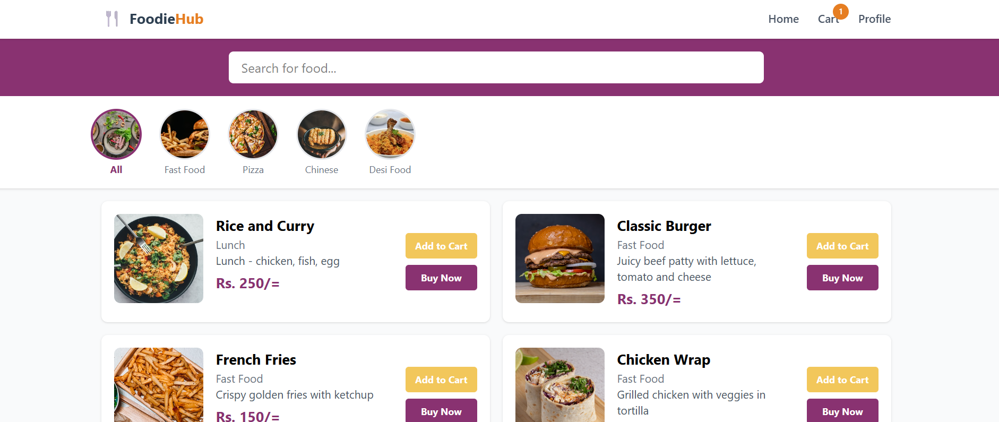
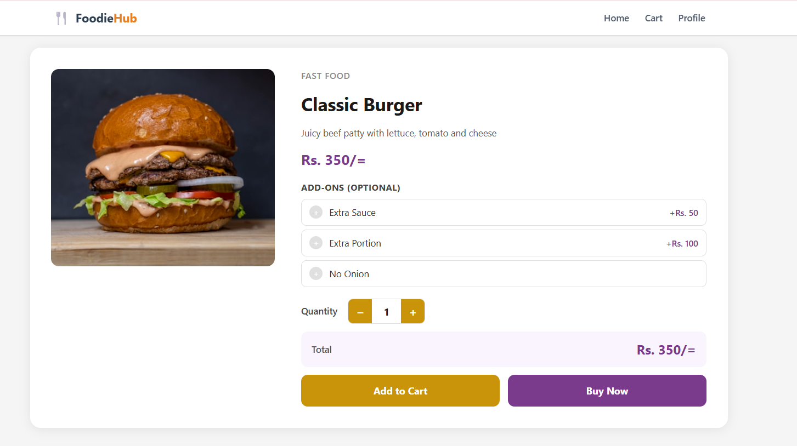
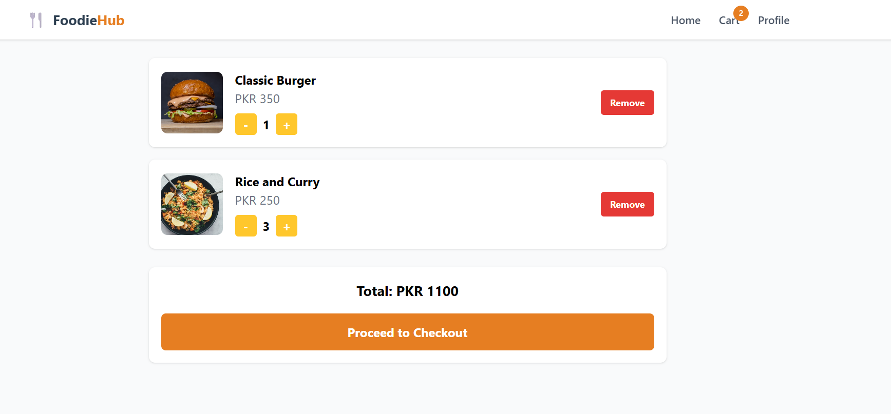
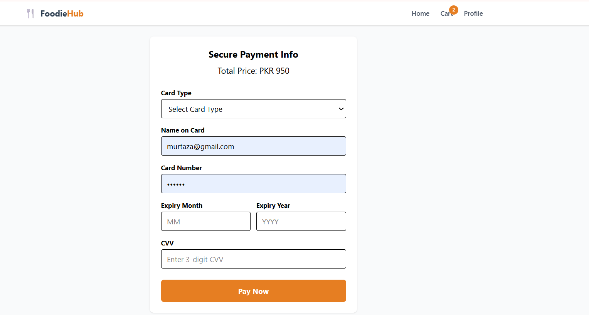
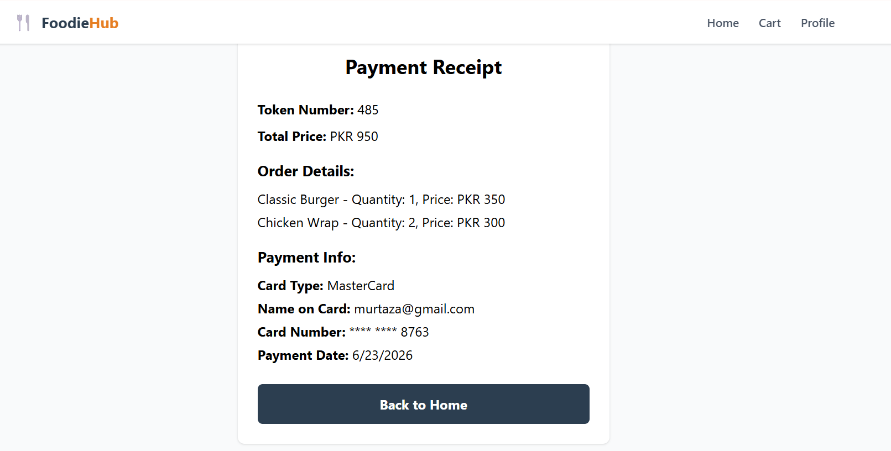
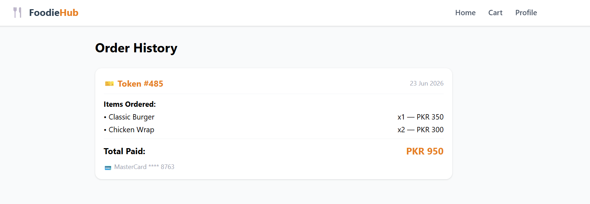
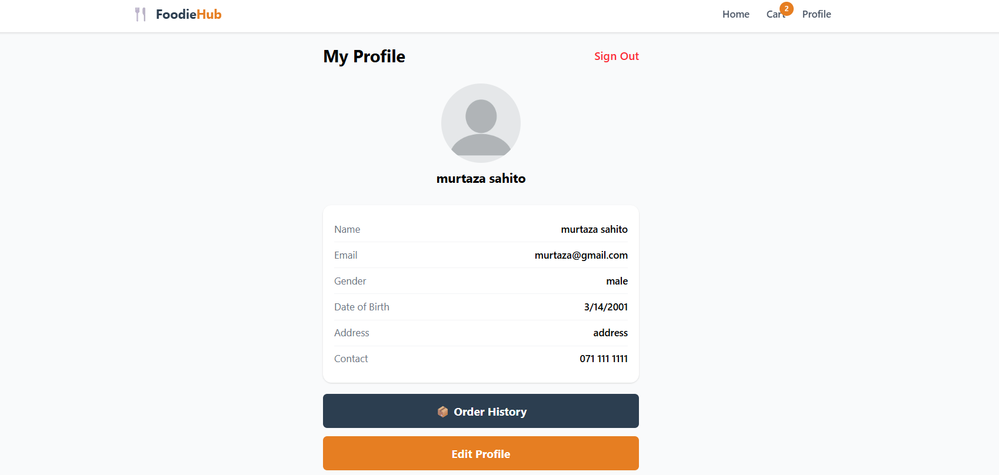

<div align="center">

# 🍴 FoodieHub — Restaurant Web App

**Your favourite food, delivered fast 🚀**


</div>

---

## 📖 About

FoodieHub is a full-stack food ordering web application where users can browse food items by category, search for their favourites, add items to cart, and place orders with secure payment — all from their browser.

This is the **web version** of the FoodieHub mobile app built with React Native & Expo.

---

## ✨ Features

| Feature | Description |
|---------|-------------|
| 🔐 Authentication | Secure Register & Login with JWT tokens |
| 🏠 Home Page | Browse all food items with live search |
| 🍔 Category Filter | All, Fast Food, Pizza, Chinese, Desi Food |
| 🍽️ Food Detail | Item info, add-ons, quantity selector |
| 🛒 Cart | Add, remove, increment/decrement items |
| 💳 Payment | Secure card payment processing |
| 🧾 Receipt | Payment confirmation with order token |
| 📦 Order History | Track all past orders |
| 👤 Profile | View personal information |
| 🔔 Modals | Success & error feedback throughout |
| 📱 Responsive | Works on desktop and mobile |

---

## 📸 Screenshots

### 🏠 Home Page


### 🍽️ Food Detail


### 🛒 Cart


### 💳 Payment


### 🧾 Receipt


### 📦 Order History


### 👤 Profile


---

## 🛠️ Tech Stack

### Frontend
| Technology | Purpose |
|-----------|---------|
| React 19 | UI Framework |
| Vite | Build Tool |
| React Router DOM | Page Navigation |
| Tailwind CSS | Styling |
| Context API | Cart & User State Management |

### Backend
| Technology | Purpose |
|-----------|---------|
| Node.js | Runtime Environment |
| Express.js | Web Framework |
| MongoDB Atlas | Database |
| Mongoose | ODM |
| bcryptjs | Password Hashing |
| JWT | Authentication |

---

## 📁 Project Structure

```
foodieHub-web/
├── 📁 public/
├── 📁 src/
│   ├── 📁 assets/
│   │   ├── home.png
│   │   ├── foodDetail.png
│   │   ├── cart.png
│   │   ├── paymentinfo.png
│   │   ├── paymentreceipt.png
│   │   ├── orderhistory.png
│   │   └── profile.png
│   ├── 📁 components/
│   │   ├── Navbar.jsx
│   │   ├── Footer.jsx
│   │   └── Modal.jsx
│   ├── 📁 pages/
│   │   ├── Login.jsx
│   │   ├── Register.jsx
│   │   ├── Home.jsx
│   │   ├── FoodDetail.jsx
│   │   ├── Cart.jsx
│   │   ├── Payment.jsx
│   │   ├── Receipt.jsx
│   │   ├── OrderHistory.jsx
│   │   └── Profile.jsx
│   ├── App.jsx
│   ├── CartContext.jsx
│   ├── UserContext.jsx
│   └── main.jsx
├── index.html
├── package.json
└── vite.config.js
```

---

## 🚀 Getting Started

### Prerequisites
- Node.js installed
- npm package manager

### Installation

```bash
# 1. Clone the repository
git clone https://github.com/Basma-Hassan95/foodieHub-webApp.git
cd foodieHub-webApp

# 2. Install dependencies
npm install

# 3. Start development server
npm run dev
```

Open [http://localhost:5173](http://localhost:5173) in your browser ✅

---

## 🌐 Backend & Deployment

| | Link |
|-|------|
| 🔗 Live Web App | [foodiehub on Vercel](https://foodiehub-webApp.vercel.app) |
| ⚙️ Backend API | https://foodiehub-backend-production.up.railway.app |
| 📱 Mobile App Repo | [foodieHub-frontend](https://github.com/Basma-Hassan95/foodieHub-frontend) |
| ⚙️ Backend Repo | [foodieHub-backend](https://github.com/Basma-Hassan95/foodieHub-backend) |

### API Endpoints

| Method | Endpoint | Description |
|--------|----------|-------------|
| POST | /register | Register new user |
| POST | /login | Login user |
| GET | /getAllFoods | Get all food items |
| GET | /user/:userId | Get user profile |
| PUT | /user/:userId | Update user profile |
| POST | /savepayment | Save payment details |
| GET | /getOrdersByUser/:userId | Get order history |

---

## 🔗 Related Projects

- 📱 **Mobile App:** [FoodieHub React Native](https://github.com/Basma-Hassan95/foodieHub-frontend)
- ⚙️ **Backend API:** [FoodieHub Backend](https://github.com/Basma-Hassan95/foodieHub-backend)

---

## 👩‍💻 Developer

<div align="center">

**Basma Hassan**

[](https://github.com/Basma-Hassan95)

</div>

---

## 📄 License

This project is open source and available under the [MIT License](LICENSE).

---

<div align="center">

Made with ❤️ by Basma Hassan

</div>